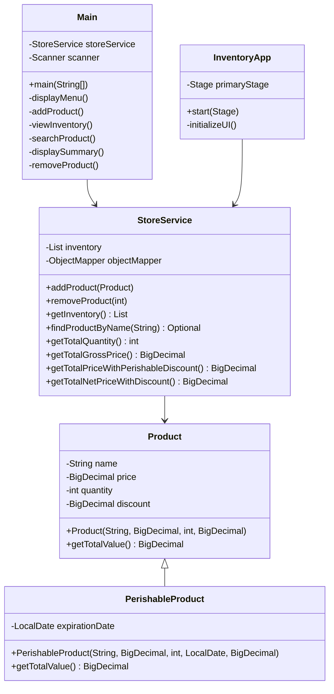

# Java Store Inventory Management System

## Project Synopsis
A comprehensive Java application for managing store inventory, featuring both console and graphical user interfaces. The system handles regular and perishable products, calculates discounts based on product type and expiration dates, and provides robust data persistence through JSON files. Built with a modular architecture, the application demonstrates object-oriented design principles and offers a complete inventory management solution for small to medium businesses.

## Project Structure

```
javascriptstoreinventory/
├── src/
│   ├── main/
│   │   ├── java/
│   │   │   └── com/
│   │   │       └── store/
│   │   │           ├── model/
│   │   │           │   ├── Product.java
│   │   │           │   └── PerishableProduct.java
│   │   │           ├── service/
│   │   │           │   └── StoreService.java
│   │   │           ├── gui/
│   │   │           │   └── InventoryApp.java
│   │   │           └── Main.java
│   │   └── resources/
│   └── test/
│       └── java/
│           └── com/
│               └── store/
│                   └── service/
│                       └── StoreServiceTest.java
├── pom.xml
└── README.md
```

## Class Structure



## Package Structure

- **com.store.model**
  - [Product.java](#product-java): Base class for all products
  - [PerishableProduct.java](#perishable-product-java): Extends Product with expiration date functionality

- **com.store.service**
  - [StoreService.java](#store-service-java): Handles business logic and data persistence

- **com.store.gui**
  - [InventoryApp.java](#inventory-app-java): JavaFX-based graphical user interface

- **com.store**
  - [Main.java](#main-java): Application entry point and user interface

## Maven Configuration

```xml
<groupId>com.store</groupId>
<artifactId>javascriptstoreinventory</artifactId>
<version>1.0-SNAPSHOT</version>
```

## Features

1. **Product Management**
   - Add regular and perishable products
   - Remove products
   - Search products by name
   - View complete inventory

2. **Price Calculations**
   - Total quantity calculation
   - Gross price calculation
   - Perishable product discount (20% for products expiring within 7 days)
   - Additional 15% discount on total

3. **Data Persistence**
   - Automatic saving to JSON file
   - Automatic loading on startup

4. **User Interface Options**
   - Console-based interface
   - Graphical user interface (GUI)

## User Interface Options

### GUI Screenshot


## Usage Instructions

1. **Adding a Product**
   - Select option 1 from the menu
   - Enter product details
   - Choose whether it's a perishable product
   - Enter expiration date if applicable

2. **Viewing Inventory**
   - Select option 2 to view all products
   - Products are displayed with their details and discounts

3. **Searching Products**
   - Select option 3
   - Enter product name
   - View product details if found

4. **Viewing Summary**
   - Select option 4
   - View total quantities and prices
   - See applied discounts

5. **Removing Products**
   - Select option 5
   - View current inventory
   - Enter index of product to remove

## Data Storage

The application stores data in a JSON file named `inventory.json` located at:
1. **Location**: 
   - Primary location: `~/.store-inventory/inventory.json` (in the user's home directory)
   - Fallback location: `src/main/resources/inventory.json`

2. **Persistence**:
   - The file is automatically created if it doesn't exist
   - Data is loaded on application startup
   - Changes are automatically saved when:
     - Adding new products
     - Removing products
     - Modifying product details

3. **Shared Access**:
   - Both the console and GUI interfaces access the same inventory file
   - Changes made in one interface will be visible in the other

4. **Error Recovery**:
   - If a file becomes corrupted, a backup is created with `.bak` extension
   - The application will create a new file if necessary

## Error Handling

The application includes comprehensive error handling for:
- Invalid user input
- File I/O operations
- Data parsing
- Date format validation
- Number format validation

## Output Examples  
### Menu 

### Adding a Product

### Viewing Inventory

### Searching Products
     
### Viewing Summary

### GUI Screenshot


## Development Guide

### Code Organization
- **Model classes** (`Product`, `PerishableProduct`) focus on data structure and business logic
- **Service classes** implement interfaces and handle all operations on models
- **UI classes** are kept separate from business logic to ensure separation of concerns

### Commenting Standards
- All classes should include a descriptive class-level JavaDoc comment
- Public methods must have JavaDoc comments describing:
  - Purpose of the method
  - Parameter descriptions
  - Return value description
  - Any exceptions thrown
- Complex algorithms should include inline comments explaining the approach

### Testing Guidelines
- Unit tests should be written for all business logic
- Each test method should focus on testing one specific behavior
- Use descriptive method names that explain what is being tested
- Follow the Arrange-Act-Assert pattern for test structure

### Git Workflow
```bash
# Clone the repository
git clone https://github.com/username/JavaStoreInventorySystem.git

# Create a feature branch
git checkout -b feature/name-of-feature

# Make changes and commit
git add .
git commit -m "Descriptive commit message"

# Push changes to remote
git push origin feature/name-of-feature

# Create pull request on GitHub
```

## Project Contributors
Author 1:   [Harry Joseph](https://github.com/hJoseph777)
Author 2:   [Trish](https://github.com/trishh)

